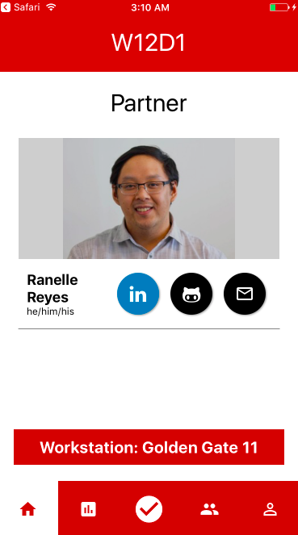
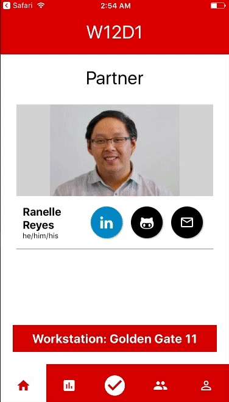
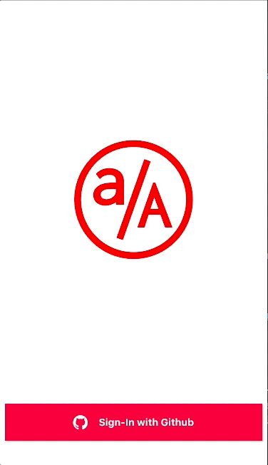

# Progress Tracker Mobile

Progress Tracker Mobile is the mobile extraction of [App Academy](appacademy.io)'s Progress Tracker.  Progress Tracker Mobile brings ease-of-use, functionality and intuitive navigation into the hands of students at aA.

[Demo Page](https://mazuolas.github.io/ProgressTrackerMobile/index.html)

## Implementation

* React Native
  - `react-native-oauth`
  - `react-native-elements`
  - `react-navigation`
* Ruby on Rails
* Github OAuth 2.0

## Features

#### *Easy and automatic check-ins*

Simple check-in to make staying on track intuitive and effortless.

#### *Daily pair assignments*

Displays current day, pair assignment, and workstation on authentication for quick access.

#### *Classmates Directory*

Learn about your classmates and watch them grow professionally with direct access to github repo and LinkedIn.

#### *Assessment Statistics*

Visual representation of current and past assessment scores with added metrics for clarity.

#### *Github OAuth 2.0*

Utilizes `react-native-oauth` with a `rails` API for authentication.

## Roadmap
- [ ] Daily reports and quizzes
- [ ] Todo list for students
- [ ] Upcoming checkin availability
- [ ] Contact submission
