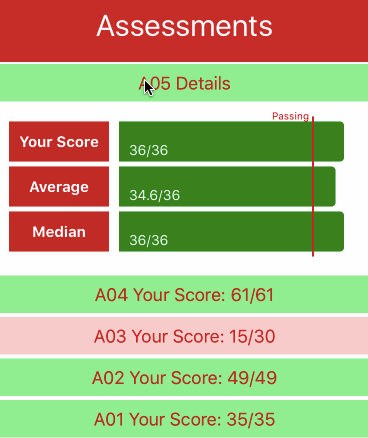

# Progress Tracker Mobile

Progress Tracker Mobile is a mobile version of App Academy's [Progress Tracker](http://progress.appacademy.io/), with a focus on making the most
common use cases -- checking in, viewing pair assignments, browsing classmates --
as easy and fluid as possible.

[Demo Page](https://mazuolas.github.io/ProgressTrackerMobile/index.html)

## Technologies

* React Native
* Rails API
* Heroku deployment
* Github OAuth

## Features

### Easy and automatic check-ins

Uses geolocation and time windows to automatically validate student attendance.

### Daily pair assignments

Displays current day, pair assignment, and workstation.

### Classmates Directory

For those times when you forget someone's name or want to check their latest Github commits.

### Assessment Statistics

Visually examine test scores compared to passing score, median, and average.

### Github OAuth

Utilizes Github credentials for seamless login, logout, and sessions

## Future Features
* Daily reports and quizzes
